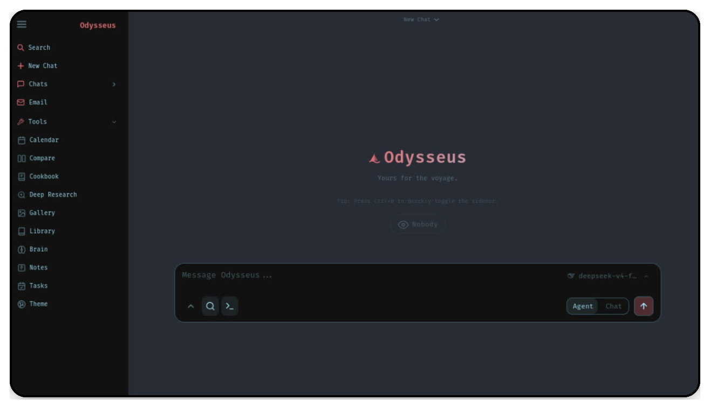

<p align="center">
  
</p>

<p align="center">
  A self-hosted AI workspace for chat, agents, research, documents, email, notes, calendar, and local model workflows.
</p>

<p align="center">
  <a href="#quick-start">Quick Start</a> ·
  <a href="docs/setup.md">Setup Guide</a> ·
  <a href="CONTRIBUTING.md">Contributing</a> ·
  <a href="ROADMAP.md">Roadmap</a>
</p>

<p align="center">
  <a href="https://repology.org/project/odysseus-ai/versions"></a>
</p>

<p align="center">
  
</p>

---

## Quick Start

> `dev` is the default branch and gets the newest changes first. Use [`main`](https://github.com/pewdiepie-archdaemon/odysseus/tree/main) if you want the more curated branch.

```bash
git clone https://github.com/pewdiepie-archdaemon/odysseus.git
cd odysseus
cp .env.example .env
docker compose up -d --build
```
To include optional extras in the image (PDF viewer, Office extraction; includes AGPL PyMuPDF), build with `docker compose build --build-arg INSTALL_OPTIONAL=true` before `up`.

Open `http://localhost:7000` when the containers are healthy. Docker Compose
binds the web UI to `127.0.0.1` by default. If the port is taken, set
`APP_PORT=7001` in `.env` and recreate the container. Set `APP_BIND=0.0.0.0`
only when you intentionally want LAN/reverse-proxy access.

### Native Linux / macOS
```bash
git clone https://github.com/pewdiepie-archdaemon/odysseus.git
cd odysseus
python3 -m venv venv
source venv/bin/activate
pip install -r requirements.txt
python setup.py
python -m uvicorn app:app --host 127.0.0.1 --port 7000
```
Requirements: Python 3.11+. Cookbook also needs `tmux` for background model
downloads and serves. The app itself is lightweight; local model serving is the
heavy part and depends on the model, runtime, GPU, and VRAM, so small hosts can
connect to API or remote model servers instead. Use `--host 0.0.0.0` only when you intentionally want LAN/reverse-proxy access.

### Apple Silicon
Docker on macOS cannot use the Metal GPU. For GPU-accelerated Cookbook on an
M-series Mac, run Odysseus natively:

```bash
git clone https://github.com/pewdiepie-archdaemon/odysseus.git
cd odysseus
./start-macos.sh
```

It launches at `http://127.0.0.1:7860`. To expose it to your phone over a trusted LAN/VPN such as Tailscale, bind all interfaces:

```bash
ODYSSEUS_HOST=0.0.0.0 ./start-macos.sh
# then open http://<tailscale-ip>:7860
```

The script also reads `.env` at startup, so `APP_BIND=0.0.0.0` and `APP_PORT`
set there are picked up automatically without a command-line override each run.

Keep `AUTH_ENABLED=true` (the default) before binding outside loopback. Do not
expose this port directly to the public internet. To build a clickable app wrapper:

```bash
./build-macos-app.sh
```

### Local Voice and Dictation (Maximus)

Odysseus supports fully local, offline speech synthesis (Text-to-Speech) using Kokoro ONNX and dictation (Speech-to-Text) using faster-whisper.

#### 1. Text-to-Speech (Kokoro TTS)

Odysseus supports offline high-quality speech synthesis. Responses can be read aloud sentence-by-sentence as they stream.

To configure local TTS:
1. Download the Kokoro ONNX model (`kokoro-v1.0.onnx`) and the voices binary (`voices-v1.0.bin`) from the official [Kokoro-ONNX Releases](https://github.com/thewh1teagle/kokoro-onnx/releases/tag/model-files-v1.0).
2. Place these files inside the `kokoro-v1.0/` folder in the project root:
   * `kokoro-v1.0/kokoro-v1.0.onnx`
   * `kokoro-v1.0/voices-v1.0.bin`
3. Open the **Settings** modal in the Odysseus UI.
4. Go to the **Maximus** section.
5. Set the absolute path of the directory (it defaults to the `kokoro-v1.0` folder in the project directory).
6. Click **Cargar Voces** to fetch the list of voices, choose your default voice (which indicates its accent/language and gender), and click **Guardar Configuración**.
7. Toggle speech synthesis on/off in the chat input bar by clicking the speaker icon next to the shell toggle.

#### 2. Speech-to-Text (Whisper STT)

Odysseus allows you to dictate your messages locally via your microphone using `faster-whisper`.

To configure local STT:
1. Ensure `faster-whisper` and its optional dependencies are installed. You can install them by running:
   ```bash
   pip install faster-whisper
   ```
2. Open the **Settings** modal in the Odysseus UI and navigate to the **Maximus** section.
3. Select the desired **Modelo de Whisper** (from lightweight models like `tiny` or `base` up to larger models like `medium` or `large-v3` depending on your available VRAM/RAM).
4. Select the **Idioma** (language) of your speech (defaults to `Auto-detect`, with Spanish and English conveniently placed at the top of the list).
5. Configure the hardware and memory optimization settings:
   * **Aceleración por GPU (CUDA)**: Toggle whether you want to use GPU acceleration (uses CUDA) for fast transcription, or turn it off to run on CPU and save VRAM for your local LLM.
   * **Precargar modelo al inicio**: Toggle whether you want to load the model weights into memory immediately on startup, or lazy-load it only when you press the microphone button for the first time (recommended to keep VRAM free).
6. Save the settings by clicking **Guardar Configuración**.
7. A microphone icon will appear in the chat composer bar. Click it to start recording your voice, and click it again to stop and automatically transcribe the audio into the chat input.


<details>

<summary>Cookbook, GPU, Ollama, and troubleshooting notes</summary>

**Docker bundled services.** Compose starts Odysseus, ChromaDB, SearXNG, and
ntfy. Odysseus and the bundled service ports bind to `127.0.0.1` by default, so
they are reachable from the host but not exposed to your LAN/public internet
unless you opt in.

**Cookbook storage in Docker.** Downloads live in `./data/huggingface`
(`~/.cache/huggingface` in the container). Cookbook-installed Python CLIs and
serve engines live in `./data/local` (`~/.local` in the container), so they
survive container recreation.

**Remote servers.** In **Cookbook -> Settings -> Servers**, generate the
Odysseus SSH key and add the public key to the remote server's
`~/.ssh/authorized_keys`. From the host you can also run:

```bash
ssh-copy-id -i data/ssh/id_ed25519.pub user@server
```

**Docker GPU overlays.** CPU-only users can skip this section. Cookbook can
only detect GPUs that Docker exposes to the container — if the host runtime or
device passthrough is not configured, Cookbook sees the iGPU, another card, or
CPU instead of your intended GPU.

For NVIDIA, `scripts/check-docker-gpu.sh` diagnoses GPU passthrough and can
optionally install the host runtime or update `.env`.

```bash
# Read-only diagnostic (default — installs nothing, never edits .env):
scripts/check-docker-gpu.sh

# Print OS-specific install commands without running them:
scripts/check-docker-gpu.sh --print-install-commands

# Install NVIDIA Container Toolkit on Ubuntu/Debian (requires sudo):
scripts/check-docker-gpu.sh --install-nvidia-toolkit

# Write COMPOSE_FILE to .env (only when GPU passthrough is confirmed working):
scripts/check-docker-gpu.sh --enable-nvidia-overlay

# Full assisted setup — install toolkit, then enable overlay if passthrough works:
scripts/check-docker-gpu.sh --install-nvidia-toolkit --enable-nvidia-overlay
```

Safety notes:
- The app never installs host GPU runtime automatically.
- The app never edits `.env` automatically.
- `.env` is only modified when `--enable-nvidia-overlay` is explicitly passed,
  and only after GPU passthrough succeeds. `--yes` skips prompts but does not
  bypass the passthrough gate.
- `.env.bak.*` backups created by `--enable-nvidia-overlay` are ignored by
  Git and the Docker build context.

To enable manually without the script, add this to `.env`:

```bash
COMPOSE_FILE=docker-compose.yml:docker/gpu.nvidia.yml
```

**AMD / ROCm.** AMD setup is read-only diagnostic plus manual `.env` edit. Run:

```bash
scripts/check-docker-amd-gpu.sh
```

Then add the reported values to `.env`, replacing `RENDER_GID` with your host's
numeric render group id:

```bash
COMPOSE_FILE=docker-compose.yml:docker/gpu.amd.yml
RENDER_GID=989
```

Open `http://localhost:7000` when the containers are healthy. The first admin password is printed in `docker compose logs odysseus`.

Native installs, GPU notes, Windows/macOS instructions, HTTPS, and configuration live in the [setup guide](docs/setup.md).

## Features

- **Chat + Agents** — local/API models, tools, MCP, files, shell, skills, and memory.
- **Cookbook** — hardware-aware model recommendations, downloads, and serving.
- **Deep Research** — multi-step web research with source reading and report generation.
- **Compare** — blind side-by-side model testing and synthesis.
- **Documents** — writing-first editor with AI edits, suggestions, Markdown, HTML, CSV, and syntax highlighting.
- **Email** — IMAP/SMTP inbox with triage, tags, summaries, reminders, and reply drafts.
- **Notes, Tasks + Calendar** — reminders, todos, scheduled agent tasks, and CalDAV sync.
- **Extras** — gallery/image editor, themes, uploads, web search, presets, sessions, and 2FA.

## Demo

A full hover-to-play tour lives on the landing page: [`docs/index.html`](docs/index.html).

## Contributing

Help is welcome. The best entry points are fresh-install testing, provider setup bugs, mobile/editor polish, docs, and small focused refactors. See [CONTRIBUTING.md](CONTRIBUTING.md) and [ROADMAP.md](ROADMAP.md).

## Security

Odysseus is a self-hosted workspace with powerful local tools. Keep auth enabled, keep private data out of Git, and do not expose raw model/service ports publicly. Deployment details are in the [setup guide](docs/setup.md#security-notes).

## Star History

<a href="https://www.star-history.com/?repos=pewdiepie-archdaemon%2Fodysseus&type=date&legend=top-left">
 <picture>
   <source media="(prefers-color-scheme: dark)" srcset="https://api.star-history.com/chart?repos=pewdiepie-archdaemon/odysseus&type=date&theme=dark&legend=top-left" />
   <source media="(prefers-color-scheme: light)" srcset="https://api.star-history.com/chart?repos=pewdiepie-archdaemon/odysseus&type=date&legend=top-left" />
   
 </picture>
</a>

## License

AGPL-3.0-or-later -- see [LICENSE](LICENSE) and [ACKNOWLEDGMENTS.md](ACKNOWLEDGMENTS.md).
